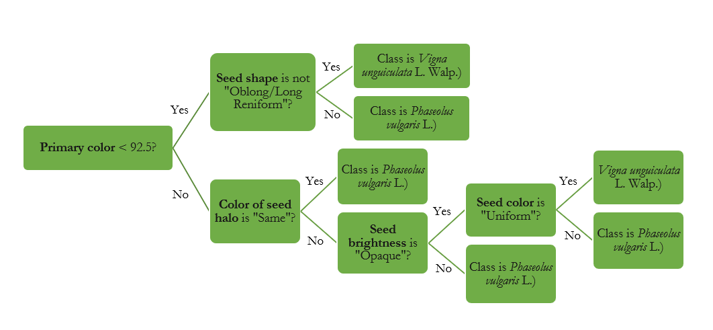

# A qualitative Decision Tree model for Common Beans and Cowpea classification

**Authros:** Bruno Rodrigues de Oliveira(1,*),  Jorge González Aguilera(1,2),  Fabio Steiner(2), Diógenes Martins Bardiviesso(2) and Leandris Argentel-Martínez(3)

1 Pantanal Editora, Nova Xavantina-MT; 
2 Universidade Estadual de Mato Grosso do Sul/UEMS, Departamento de Agronomia, Cassilândia, MS, Brasil; 
3 Tecnológico Nacional de México, Instituto Tecnológico del Valle del Yaqui, Bácum, Sonora, México;
Correspondence: bruno@pantanaleditora.com.br

**Abstract:** Common beans and cowpea are two grains that form part of the preferred diet in several countries, mainly due to their nutritional value. Knowledge of their diversity is important for plant breeding and determines the conservation and use strategy. Previous analyzes show that there is variability for a set of qualitative and quantitative descriptors for this species. The objective of the work was to use data from qualitative descriptors to generate a decision tree model that makes it possible to classify common bean and cowpea genotypes. 17 bean genotypes were used, 12 of which were common beans and 5 were cowpeas. Eight qualitative descriptors were used to characterize the bean genotypes. Machine learning techniques were used to generate decision tree models for classifying bean genotypes. Using the accuracy, precision and F1-score metrics in the cross-validation approach, we select the best decision tree model. This model was adapted into a flowchart for use in various purposes, aiming to classify beans based on qualitative descriptors.

